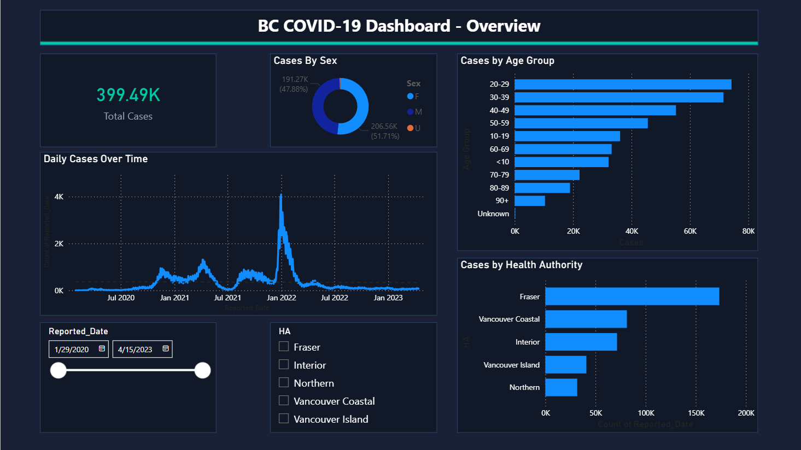
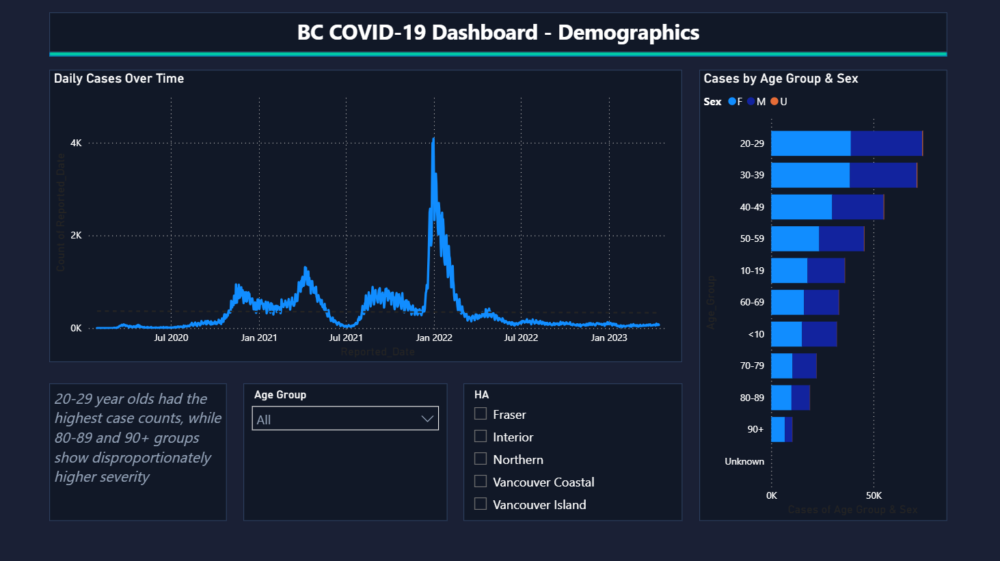

BC COVID-19 Public Health Dashboard built in Power BI using BCCDC open data. Features interactive slicers for date range, health authority, and age group across two pages.

BC COVID-19 Dashboard — Key Insights

- Total cases: 399,490 reported cases across BC from January 2020 to April 2023
- Case trend: Daily cases remained low through mid-2021, surged sharply in January 2022 to a peak of approximately 4,000 daily cases driven by the Omicron wave, then declined steadily through 2023
- By health authority: Fraser Health recorded the highest case counts by a significant margin, followed by Vancouver Coastal and Interior
- By age group: The 20–29 age group had the highest case counts, followed closely by 30–39 and 40–49, suggesting working-age adults were the most affected population
- By sex: Males accounted for a slight majority at 51.71% of cases versus 47.88% female
- Severity note: While 80–89 and 90+ age groups had lower overall case counts, these groups show disproportionately higher severity outcomes

